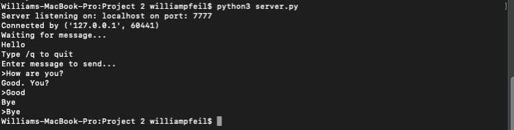
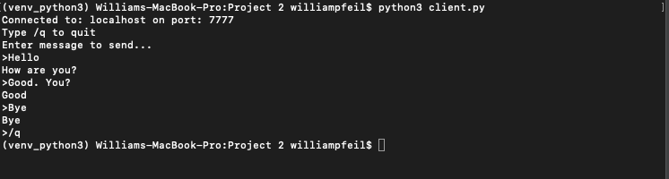

# Programming Project: Client-Server Chat (Portfolio Assignment)

## Introduction 

In this coding project you will write a simple client-server program using python sockets. Your program will emulate a simple chat client. For **extra-credit** (points tbd), turn your chat program into a simple ascii multiplayer game (see below for spec).

## Writing a client-server socket program 

This chat client-server is fairly simple in design. The server doesn’t handle multiple clients, and there is only one socket connection made. You will reuse this socket for the life of the program. The one issue with reusing sockets is that there is no easy way to tell when you’ve received a complete communication:
 
“… if you plan to reuse your socket for further transfers, you need to realize that there is no EOT (end of transmission) on a socket. I repeat: if a socket `send` or `recv` returns after handling 0 bytes, the connection has been broken. If the connection has not been broken, you may wait on a `recv` forever, because the socket will not tell you that there’s nothing more to read (for now). Now if you think about that a bit, you’ll come to realize a fundamental truth of sockets: messages must either be **fixed length** (yuck), or be **delimited** (shrug), or **indicate how long they are** (much better), or **end by shutting down the connection**. The choice is entirely yours, (but some ways are righter than others).”

**Source:**  [https://docs.python.org/3.4/howto/sockets.html](https://docs.python.org/3.4/howto/sockets.html)
 
Note: in the process of testing, you can “**hang**” a port. This will give an error when you start the server: [[Errno 48] Address already in use](https://stackoverflow.com/questions/19071512/socket-error-errno-48-address-already-in-use). Don’t worry, the ports will recycle eventually.

There are several ways around this, including simply specifying a different port every time you run. A good alternative, that mostly works, is to set a socket reuse option before the bind command on the server:  `s.setsockopt(socket.SOL_SOCKET, socket.SO_REUSEADDR, 1)`

## Specification

#### Server

1. The server creates a socket and binds to ‘**localhost**’ and port **xxxx**
2. The server then **listens** for a connection
3. When connected, the server calls `recv` to receive data
    1. The server **prints** the data, then **prompts** for a reply
    2. If the reply is `/q`, the server **quits**
    3. Otherwise, the server sends the reply
    4. Back to **step 3**
4. Sockets are closed (can use `with` in python3)

#### Client

1. The client creates a socket and connects to ‘**localhost**’ and port **xxxx**
2. When connected, the client **prompts for a message to send**
    1. If the message is `/q`, the client **quits**
    2. Otherwise, the client **sends** the message
    3. The client calls `recv` to receive data
    4. The client **prints** the data
    5. Back to **step 2**
3. Sockets are **closed** (can use `with` in python3)

## A better spec might just be to show example screenshots:

## What to turn in 
1. In the Word doc:
    1. Include **instructions** on how to run your programs. Are they **python3**?
    2. Include **screenshots** of your running code.
    3. Include **comments / questions** (optional)
2. In your code listings:
    1. Include **sources** you used (web pages, tutorials, books, etc)
    2. Comment your code
   

## Extra Credit 

Turn your client-server into a multiplayer **ascii game**. Tic-tac-toe? Hangman? The choice is up to you. Points awarded subjectively based on effort. **5 extra points possible**.

## Resources

[Python Sockets - How To](https://docs.python.org/3.4/howto/sockets.html)  
[Python Sockets Docs](https://realpython.com/python-sockets/)